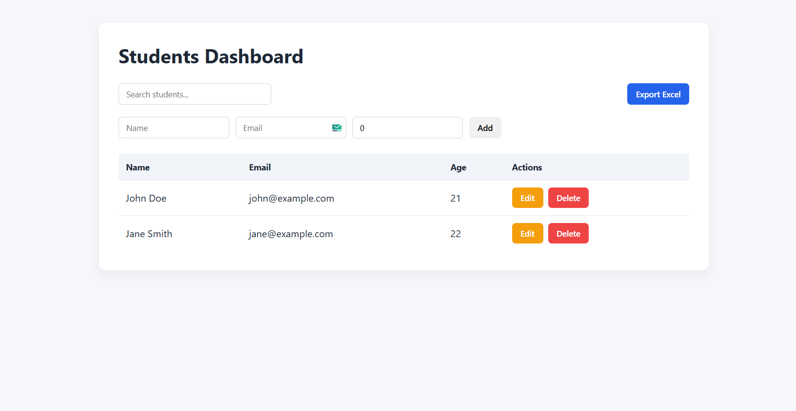

# Student Manager React

A simple **React.js Students Dashboard** that demonstrates frontend CRUD operations without any backend.
All data is managed using **React state and localStorage**, simulating a real-world full-stack workflow.

This project was built as part of a **Full Stack Assignment – Students Table** where the frontend handles all operations.

---

## Dashboard Preview



---

## Features

* Students table with columns:

  * Name
  * Email
  * Age
  * Actions (Edit / Delete)

* Add student form with validation

  * All fields required
  * Valid email format
  * Age must be a number

* Edit student

  * Pre-filled form
  * Same validation rules

* Delete student

  * Confirmation dialog

* Search students by name or email

* Simulated loading state

* Export students to Excel

  * Export full data
  * Export filtered results

* LocalStorage persistence

  * Data remains after page refresh

---

## Tech Stack

Frontend

* React
* TypeScript
* Vite
* React Hook Form
* XLSX (Excel export)
* Vanilla CSS

---

## Installation

Clone the repository

```bash
git clone https://github.com/yourusername/student-manager-react.git
```

Navigate to the project folder

```bash
cd student-manager-react
```

Install dependencies

```bash
npm install
```

---

## Run Development Server

```bash
npm run dev
```

Open in browser

```
http://localhost:5173
```

---

## Build for Production

```bash
npm run build
```

Preview production build

```bash
npm run preview
```

---

## Assignment Notes

This implementation follows the assignment requirements:

* Fully functional frontend
* CRUD operations handled in React
* No backend required
* Data stored using localStorage
* Excel export supported
* Validation implemented
* Loading state simulated

---

## Future Improvements

Possible enhancements:

* Pagination
* Table sorting
* Toast notifications
* Better modal UI
* Backend API integration
* Authentication
* Dark mode dashboard
